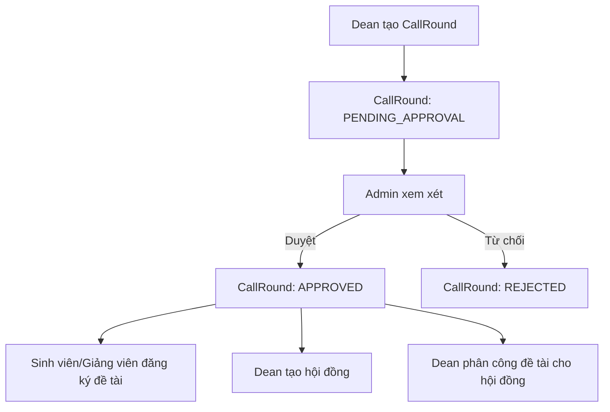

# Luồng sự kiện: Trưởng Khoa tạo đợt đăng ký đề tài (CallRound)

## 1. Mục tiêu

Tài liệu mô tả luồng Trưởng Khoa (`DEAN`) tạo một đợt đăng ký đề tài mới. Đợt sau khi tạo có trạng thái `PENDING_APPROVAL` và cần Admin phê duyệt trước khi sinh viên/giảng viên có thể đăng ký đề tài.

## 2. Tác nhân và phạm vi

| Thành phần | Nội dung |
|---|---|
| Tác nhân chính | Trưởng Khoa (`DEAN`) |
| Tác nhân phụ | Admin nhận thông báo/phê duyệt |
| Màn hình | Trang quản lý đợt đăng ký của Dean |
| API chính | `POST /api/call-rounds` |
| Schema validate | `createCallRoundSchema` trong `types/call-round.schema.ts` |
| Bảng chính | `CallRound`, `CallRoundInstructor`, `CallRoundCouncilMember` |

## 3. Tiền điều kiện

1. Trưởng Khoa đã đăng nhập.
2. Session hợp lệ, role = `DEAN`.
3. Hệ thống có dữ liệu người dùng/giảng viên để chọn làm giảng viên hướng dẫn hoặc thành viên hội đồng.
4. Có thể có `ProgressTemplate` để gắn mẫu báo cáo tiến độ; không bắt buộc.

## 4. Dữ liệu nhập

### 4.1. Thông tin cơ bản

| Trường | Bắt buộc | Ghi chú |
|---|---:|---|
| `name` | Có | Tên đợt đăng ký, không được rỗng |
| `description` | Không | Mô tả đợt |
| `maxProjects` | Không | Số đề tài tối đa, số nguyên dương |
| `budgetLimit` | Không | Hạn mức kinh phí, số dương |
| `requirements` | Không | Yêu cầu/điều kiện đăng ký |
| `guidelines` | Không | Hướng dẫn đăng ký |
| `contactInfo` | Không | Thông tin liên hệ |

### 4.2. Thời gian

| Trường | Bắt buộc | Ghi chú |
|---|---:|---|
| `registrationStartDate` | Có | Ngày bắt đầu đăng ký |
| `registrationEndDate` | Có | Phải >= `registrationStartDate` |
| `projectStartDate` | Không | Ngày bắt đầu thực hiện đề tài |
| `projectEndDate` | Không | Nếu có, phải >= `projectStartDate` |
| `reviewDeadline` | Không | Hạn duyệt/xem xét |
| `reportingStartDate` | Không | Ngày bắt đầu nộp báo cáo tiến độ |
| `defenseDate` | Không | Ngày bảo vệ/nghiệm thu dự kiến |
| `projectLockDate` | Không | Ngày khóa chỉnh sửa đề tài |
| `invitationDeadline` | Không | Hạn phản hồi lời mời tham gia |

### 4.3. Phạm vi và cấu hình

| Trường | Bắt buộc | Ghi chú |
|---|---:|---|
| `applicableFor` | Không | `STUDENT`, `LECTURER`, `BOTH`; mặc định `STUDENT` |
| `isActive` | Không | Mặc định `true`, nhưng chưa hiển thị cho người đăng ký nếu chưa `APPROVED` |
| `isLocked` | Không | Mặc định `false` |
| `templateId` | Không | ID mẫu báo cáo tiến độ hoặc `null` |
| `departmentIds` | Không | Danh sách khoa áp dụng |
| `majorIds` | Không | Danh sách ngành áp dụng |
| `classIds` | Không | Danh sách lớp áp dụng |
| `instructorIds` | Không | Danh sách giảng viên hướng dẫn được chỉ định |
| `councilMemberIds` | Không | Danh sách thành viên hội đồng được chỉ định |

## 5. Luồng sự kiện chính

### Bước 1. Mở chức năng tạo đợt

1. Trưởng Khoa truy cập trang quản lý đợt đăng ký.
2. Frontend gọi API danh sách đợt hiện có để hiển thị bảng.
3. Trưởng Khoa nhấn nút tạo mới.
4. Hệ thống mở dialog/form tạo đợt đăng ký.

### Bước 2. Nhập thông tin đợt

1. Trưởng Khoa nhập `name`.
2. Trưởng Khoa nhập `description`, `requirements`, `guidelines`, `contactInfo` nếu cần.
3. Trưởng Khoa nhập `maxProjects`, `budgetLimit` nếu muốn giới hạn.
4. Trưởng Khoa chọn `applicableFor`: sinh viên, giảng viên hoặc cả hai.

### Bước 3. Thiết lập mốc thời gian

1. Trưởng Khoa chọn `registrationStartDate`.
2. Trưởng Khoa chọn `registrationEndDate`.
3. Trưởng Khoa có thể chọn `projectStartDate`, `projectEndDate`.
4. Trưởng Khoa có thể chọn `reviewDeadline`, `reportingStartDate`, `defenseDate`, `projectLockDate`, `invitationDeadline`.
5. Frontend/Backend validate:
   - `registrationEndDate >= registrationStartDate`.
   - Nếu đủ ngày thực hiện: `projectEndDate >= projectStartDate`.

### Bước 4. Chọn phạm vi áp dụng

1. Trưởng Khoa chọn khoa/ngành/lớp áp dụng nếu hệ thống cho phép giới hạn phạm vi.
2. Frontend đưa dữ liệu vào `departmentIds`, `majorIds`, `classIds`.
3. Nếu không chọn, đợt có thể hiểu là không giới hạn theo danh sách đó.

### Bước 5. Chọn mẫu báo cáo tiến độ

1. Hệ thống hiển thị danh sách mẫu báo cáo tiến độ.
2. Trưởng Khoa chọn một mẫu hoặc chọn không dùng mẫu.
3. Nếu không dùng mẫu, frontend gửi `templateId = null`.

### Bước 6. Chỉ định nhân sự tham gia

1. Hệ thống hiển thị danh sách giảng viên để chọn làm giảng viên hướng dẫn.
2. Trưởng Khoa chọn một hoặc nhiều giảng viên.
3. Frontend lưu danh sách vào `instructorIds`.
4. Hệ thống hiển thị danh sách giảng viên/thành viên có thể tham gia hội đồng.
5. Trưởng Khoa chọn một hoặc nhiều thành viên hội đồng.
6. Frontend lưu danh sách vào `councilMemberIds`.

### Bước 7. Gửi tạo đợt

1. Trưởng Khoa nhấn nút tạo mới.
2. Frontend validate dữ liệu bắt buộc.
3. Frontend gọi `POST /api/call-rounds`.
4. Payload gửi lên chứa dữ liệu theo `createCallRoundSchema`.

Ví dụ payload:

```json
{
  "name": "Đợt đăng ký đề tài NCKH sinh viên 2026",
  "description": "Đợt đăng ký đề tài cấp khoa",
  "registrationStartDate": "2026-06-10T00:00:00.000Z",
  "registrationEndDate": "2026-06-30T23:59:59.000Z",
  "projectStartDate": "2026-07-01T00:00:00.000Z",
  "projectEndDate": "2026-12-31T23:59:59.000Z",
  "startDate": "2026-06-10T00:00:00.000Z",
  "endDate": "2026-06-30T23:59:59.000Z",
  "maxProjects": 50,
  "budgetLimit": 100000000,
  "requirements": "Sinh viên đủ điều kiện theo quy định khoa",
  "guidelines": "Nộp đề cương và chọn giảng viên hướng dẫn",
  "contactInfo": "vpkhoa@example.edu.vn",
  "isActive": true,
  "isLocked": false,
  "applicableFor": "STUDENT",
  "templateId": null,
  "invitationDeadline": "2026-07-05T23:59:59.000Z",
  "departmentIds": ["department-id"],
  "majorIds": ["major-id"],
  "classIds": ["class-id"],
  "instructorIds": ["lecturer-id-1", "lecturer-id-2"],
  "councilMemberIds": ["lecturer-id-3", "lecturer-id-4"]
}
```

### Bước 8. Backend xử lý

1. API nhận request tại `POST /api/call-rounds`.
2. Backend đọc session bằng cơ chế auth hiện tại.
3. Backend kiểm tra người dùng đã đăng nhập.
4. Backend parse và validate body bằng `createCallRoundSchema`.
5. Backend tạo bản ghi `CallRound`.
6. Backend set thông tin phê duyệt ban đầu:
   - `approvalStatus = PENDING_APPROVAL`.
   - `createdById = userId`.
   - `createdByRole = DEAN`.
7. Backend liên kết phạm vi tổ chức nếu có:
   - `departments` theo `departmentIds`.
   - `majors` theo `majorIds`.
   - `classes` theo `classIds`.
8. Backend tạo các bản ghi `CallRoundInstructor` từ `instructorIds`.
9. Backend tạo các bản ghi `CallRoundCouncilMember` từ `councilMemberIds`.
10. Backend include dữ liệu trả về:
    - `template`.
    - `departments`, `majors`, `classes`.
    - `availableInstructors`.
    - `availableCouncilMembers`.
11. Backend trả response `201`.

Response thành công dạng tổng quát:

```json
{
  "success": true,
  "data": {
    "id": "call-round-id",
    "name": "Đợt đăng ký đề tài NCKH sinh viên 2026",
    "approvalStatus": "PENDING_APPROVAL",
    "createdByRole": "DEAN"
  }
}
```

### Bước 9. Frontend cập nhật giao diện

1. Frontend nhận response thành công.
2. Hiển thị toast: `Tạo đợt đăng ký thành công! Đang chờ Admin phê duyệt`.
3. Đóng dialog/form.
4. Reset form.
5. Invalidate/refetch query danh sách đợt đăng ký.
6. Bảng danh sách hiển thị đợt mới với badge `PENDING_APPROVAL`/`Chờ duyệt`.

## 6. Hậu điều kiện

1. Có bản ghi `CallRound` mới.
2. `approvalStatus = PENDING_APPROVAL`.
3. `createdByRole = DEAN`.
4. Danh sách giảng viên hướng dẫn được lưu trong `CallRoundInstructor` nếu có chọn.
5. Danh sách thành viên hội đồng được lưu trong `CallRoundCouncilMember` nếu có chọn.
6. Đợt chưa thể dùng để sinh viên/giảng viên đăng ký cho đến khi Admin phê duyệt thành `APPROVED`.

## 7. Luồng rẽ nhánh

### A1. Không chọn mẫu báo cáo tiến độ

1. Trưởng Khoa không chọn mẫu.
2. Frontend gửi `templateId = null` hoặc bỏ qua field.
3. Backend lưu đợt không gắn template.
4. Khi đề tài vào giai đoạn báo cáo, hệ thống không áp template tuần từ đợt này.

### A2. Không giới hạn số lượng đề tài

1. Trưởng Khoa để trống `maxProjects`.
2. Frontend gửi `maxProjects = null` hoặc bỏ qua field.
3. Backend lưu không giới hạn số lượng đề tài.

### A3. Không chỉ định giảng viên hướng dẫn

1. Trưởng Khoa không chọn `instructorIds`.
2. Backend vẫn tạo `CallRound`.
3. Không có bản ghi `CallRoundInstructor` được tạo.
4. Danh sách giảng viên cho sinh viên chọn có thể rỗng hoặc lấy theo logic mặc định của màn hình đăng ký.

### A4. Không chỉ định thành viên hội đồng

1. Trưởng Khoa không chọn `councilMemberIds`.
2. Backend vẫn tạo `CallRound`.
3. Không có bản ghi `CallRoundCouncilMember` được tạo.
4. Trưởng Khoa có thể bổ sung thành viên hội đồng ở luồng quản lý hội đồng sau khi đợt được phê duyệt.

### A5. Chọn nhiều phạm vi tổ chức

1. Trưởng Khoa chọn nhiều khoa/ngành/lớp.
2. Backend liên kết nhiều bản ghi quan hệ.
3. Đợt chỉ áp dụng cho các phạm vi đã chọn theo logic hiển thị/đăng ký.

## 8. Luồng ngoại lệ

### E1. Chưa đăng nhập hoặc hết phiên

1. Người dùng submit khi không có session hợp lệ.
2. Backend trả `401 Unauthorized`.
3. Frontend chuyển về trang đăng nhập hoặc hiển thị lỗi phiên hết hạn.

### E2. Sai vai trò

1. Người dùng không phải `DEAN` gọi chức năng tạo đợt.
2. Middleware/API chặn quyền truy cập.
3. Hệ thống hiển thị `Bạn không có quyền truy cập` hoặc lỗi tương ứng.

### E3. Thiếu tên đợt

1. `name` rỗng.
2. `createCallRoundSchema` báo lỗi `Tên đợt đăng ký không được để trống`.
3. Backend trả lỗi validate.
4. Frontend hiển thị lỗi tại field `name`.

### E4. Ngày đăng ký không hợp lệ

1. `registrationEndDate < registrationStartDate`.
2. Schema refine báo lỗi `Ngày kết thúc đăng ký phải sau ngày bắt đầu`.
3. Frontend hiển thị lỗi và không tạo đợt.

### E5. Ngày thực hiện đề tài không hợp lệ

1. Có `projectStartDate` và `projectEndDate`, nhưng `projectEndDate < projectStartDate`.
2. Schema refine báo lỗi `Ngày kết thúc đề tài phải sau ngày bắt đầu`.
3. Frontend hiển thị lỗi và không tạo đợt.

### E6. Số lượng đề tài hoặc ngân sách không hợp lệ

1. `maxProjects <= 0` hoặc không phải số nguyên dương.
2. `budgetLimit <= 0`.
3. Schema validate thất bại.
4. Frontend yêu cầu nhập lại.

### E7. Lỗi database/API

1. Backend gặp lỗi khi tạo `CallRound` hoặc bảng liên quan.
2. Backend trả response lỗi:

```json
{
  "success": false,
  "error": "Failed to create call round"
}
```

3. Frontend hiển thị toast lỗi.
4. Form giữ nguyên dữ liệu để Trưởng Khoa thử lại.

## 9. Bảng dữ liệu liên quan

| Bảng | Vai trò trong luồng |
|---|---|
| `CallRound` | Lưu thông tin đợt đăng ký, mốc thời gian, trạng thái phê duyệt |
| `CallRoundInstructor` | Lưu danh sách giảng viên hướng dẫn được chỉ định cho đợt |
| `CallRoundCouncilMember` | Lưu danh sách thành viên hội đồng được chỉ định cho đợt |
| `ProgressTemplate` | Mẫu báo cáo tiến độ gắn với đợt qua `templateId` |
| `Department`, `Major`, `Class` | Phạm vi tổ chức áp dụng cho đợt |
| `User` | Người tạo, giảng viên hướng dẫn, thành viên hội đồng |

## 10. Quy tắc nghiệp vụ

1. Chỉ Trưởng Khoa được tạo đợt đăng ký trong phân hệ Dean.
2. Đợt do Dean tạo luôn cần Admin phê duyệt trước khi sử dụng.
3. Trạng thái ban đầu là `PENDING_APPROVAL`.
4. Đợt chỉ mở đăng ký thực tế khi `approvalStatus = APPROVED`, `isActive = true`, hiện tại nằm trong khoảng `registrationStartDate` đến `registrationEndDate`.
5. `registrationEndDate` phải sau hoặc bằng `registrationStartDate`.
6. Nếu nhập thời gian thực hiện đề tài, `projectEndDate` phải sau hoặc bằng `projectStartDate`.
7. Một giảng viên có thể vừa nằm trong danh sách hướng dẫn vừa nằm trong danh sách thành viên hội đồng nếu nghiệp vụ cho phép.
8. `templateId = null` nghĩa là đợt không dùng mẫu báo cáo tiến độ.

## 11. Liên kết với luồng sau



## 12. Tài liệu/code tham chiếu

- Use case: `uml/uc/dean/use-case-tao-dot-dang-ky.md`
- API: `app/api/call-rounds/route.ts`
- Schema: `types/call-round.schema.ts`
- Prisma schema: `prisma/schema.prisma`
- Luồng liên quan Admin phê duyệt: `uml/uc/admin/use-case-phe-duyet-dot-dang-ky.md`