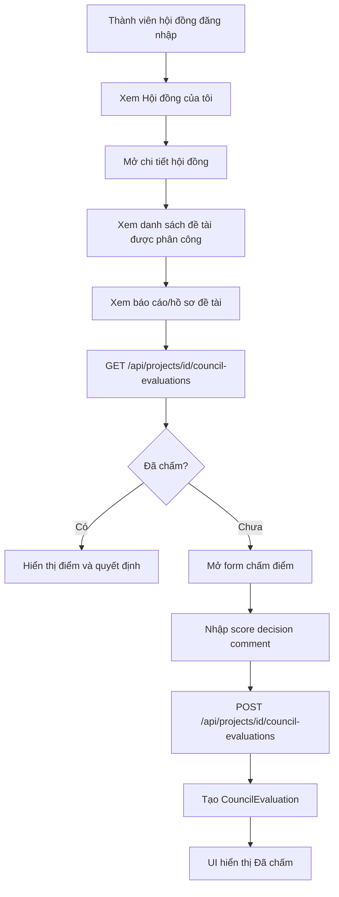
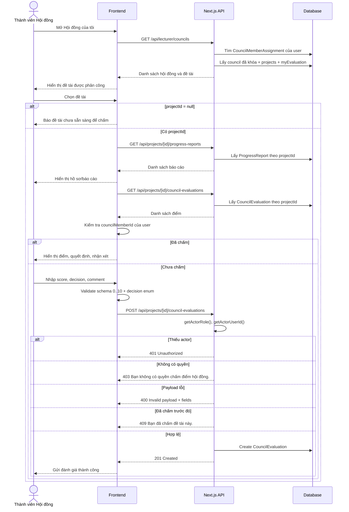

# Luồng sự kiện: Hội đồng xem báo cáo và chấm điểm đề tài

## 1. Mục tiêu

Tài liệu mô tả luồng Thành viên Hội đồng xem đề tài được phân công, xem hồ sơ/báo cáo liên quan và chấm điểm nghiệm thu/đánh giá đề tài.

## 2. Tác nhân và phạm vi

| Thành phần | Nội dung |
|---|---|
| Tác nhân chính | Thành viên Hội đồng (`LECTURER` hoặc `COUNCIL`) |
| Tác nhân phụ | Trưởng Khoa theo dõi kết quả tổng hợp |
| Màn hình | Trang `Hội đồng của tôi` / chi tiết hội đồng |
| API danh sách hội đồng | `GET /api/lecturer/councils` hoặc `GET /api/my-councils` |
| API xem điểm | `GET /api/projects/[id]/council-evaluations` |
| API chấm điểm | `POST /api/projects/[id]/council-evaluations` |
| Schema validate | `createCouncilEvaluationSchema` trong `types/council-evaluation.schema.ts` |
| Bảng chính | `Council`, `CouncilMemberAssignment`, `CouncilProjectAssignment`, `Project`, `CouncilEvaluation` |

## 3. Tiền điều kiện

1. Thành viên Hội đồng đã đăng nhập.
2. Role có quyền chấm điểm theo `canCreateCouncilEvaluation(actorRole)`.
3. Thành viên đã được thêm vào hội đồng.
4. Trưởng Khoa đã phân công đề tài cho hội đồng.
5. Đợt đã hoàn tất phân công để hội đồng nhìn thấy dữ liệu.
6. Đề tài đã tồn tại trong bảng `Project`.
7. Thành viên chưa chấm đề tài này trước đó.

## 4. Dữ liệu nhập khi chấm điểm

| Trường | Bắt buộc | Ghi chú |
|---|---:|---|
| `score` | Có | Theo code hiện tại: số từ `0` đến `10` |
| `decision` | Có | `PASS`, `NEED_REVISION`, `FAIL` |
| `comment` | Không | Nhận xét của thành viên hội đồng; có thể `null` |

Payload mẫu:

```json
{
  "score": 8.5,
  "decision": "PASS",
  "comment": "Đề tài đạt yêu cầu, cần bổ sung minh chứng triển khai thực tế."
}
```

## 5. Luồng sự kiện chính

Tóm tắt luồng:

1. Thành viên Hội đồng mở hội đồng được phân công.
2. Thành viên chọn đề tài.
3. Thành viên xem hồ sơ/báo cáo của đề tài.
4. Hệ thống kiểm tra đề tài đã được thành viên này chấm chưa.
5. Nếu chưa chấm, thành viên nhập điểm, quyết định và nhận xét.
6. Backend validate quyền, payload và chống chấm trùng.
7. Backend tạo bản ghi `CouncilEvaluation`.
8. Kết quả được dùng cho báo cáo tổng hợp của Trưởng Khoa.

### Bước 1. Thành viên mở danh sách hội đồng

1. Thành viên đăng nhập hệ thống.
2. Thành viên truy cập menu `Hội đồng của tôi`.
3. Frontend gọi API danh sách hội đồng của người dùng:

```http
GET /api/lecturer/councils
```

4. Backend lấy danh sách hội đồng mà thành viên tham gia.
5. Backend include thông tin đợt, vai trò, thành viên, đề tài được phân công và trạng thái đánh giá nếu có.
6. Frontend hiển thị danh sách hội đồng.
7. Chỉ hội đồng thuộc đợt đã khóa (`callRound.isLocked = true`) được trả về.

### Bước 2. Thành viên xem chi tiết hội đồng

1. Thành viên nhấn `Hiển thị chi tiết` trên một hội đồng.
2. Hệ thống mở dialog chi tiết hội đồng.
3. Giao diện hiển thị:
   - tên hội đồng;
   - đợt đề tài;
   - vai trò trong hội đồng;
   - ngày/nơi bảo vệ nếu có;
   - danh sách thành viên;
   - danh sách đề tài được phân công;
   - sinh viên trưởng nhóm và thành viên đề tài;
   - giảng viên hướng dẫn.

### Bước 3. Thành viên xem báo cáo/hồ sơ đề tài

1. Thành viên chọn một đề tài trong hội đồng.
2. Hệ thống hiển thị thông tin đề tài và các tài liệu liên quan nếu màn hình có tích hợp:
   - mô tả đề tài;
   - sinh viên thực hiện;
   - giảng viên hướng dẫn;
   - báo cáo tiến độ;
   - hồ sơ nghiệm thu;
   - file minh chứng/báo cáo.
3. Thành viên xem file đính kèm trong iframe hoặc mở tab mới nếu có `fileUrl`/URL hồ sơ.
4. Nếu cần xem báo cáo tiến độ, frontend gọi:

```http
GET /api/projects/[id]/progress-reports
```

5. Backend trả danh sách `ProgressReport` theo `projectId`, sắp xếp `submittedAt desc`.
6. Nếu báo cáo có file do hệ thống sinh, frontend mở:

```http
GET /api/reports/[file]
```

### Bước 4. Kiểm tra trạng thái chấm điểm

1. Frontend gọi API:

```http
GET /api/projects/[id]/council-evaluations
```

2. Backend lấy danh sách `CouncilEvaluation` theo `projectId`.
3. Backend include thông tin `councilMember`.
4. Backend sắp xếp theo `evaluatedAt desc`.
5. Frontend kiểm tra đánh giá của thành viên hiện tại.
6. Nếu đã chấm, hiển thị badge `Đã chấm` và điểm số.
7. Nếu chưa chấm, hiển thị nút `Chấm điểm`.

Response xem điểm dạng tổng quát:

```json
{
  "success": true,
  "data": [
    {
      "id": "evaluation-id",
      "projectId": "project-id",
      "councilMemberId": "member-user-id",
      "score": 8.5,
      "decision": "PASS",
      "comment": "Đạt yêu cầu",
      "evaluatedAt": "2026-06-30T09:00:00.000Z",
      "councilMember": {
        "id": "member-user-id",
        "name": "Nguyễn Văn A",
        "email": "lecturer@example.edu.vn",
        "role": "LECTURER"
      }
    }
  ]
}
```

### Bước 5. Thành viên nhập điểm và nhận xét

1. Thành viên nhấn `Chấm điểm` trên đề tài chưa chấm.
2. Hệ thống mở form chấm điểm.
3. Thành viên nhập `score`.
4. Thành viên chọn `decision`:
   - `PASS`: Đạt.
   - `NEED_REVISION`: Cần sửa đổi.
   - `FAIL`: Không đạt.
5. Thành viên nhập `comment` nếu cần.
6. Frontend validate dữ liệu trước khi gửi.
7. Hệ thống có thể hiển thị xác nhận: `Bạn có chắc chắn muốn gửi đánh giá? Sau khi gửi, bạn không thể chỉnh sửa.`

### Bước 6. Backend lưu kết quả chấm điểm

1. Frontend gọi:

```http
POST /api/projects/[id]/council-evaluations
```

2. Backend đọc actor bằng `getActorRole(request)` và `getActorUserId(request)`.
3. Nếu thiếu actor, backend trả `401 Unauthorized`.
4. Backend kiểm tra quyền bằng `canCreateCouncilEvaluation(actorRole)`.
5. Nếu không có quyền, backend trả `403` với lỗi `Bạn không có quyền chấm điểm hội đồng.`
6. Backend tìm `Project` theo `id`.
7. Nếu không có đề tài, backend trả `404 Project not found`.
8. Backend parse body bằng `createCouncilEvaluationSchema`.
9. Nếu payload không hợp lệ, backend trả `400 Invalid payload` kèm `fields`.
10. Backend kiểm tra trùng đánh giá:
    - `projectId = id`.
    - `councilMemberId = actorUserId`.
11. Nếu đã có đánh giá, backend trả `409` với lỗi `Bạn đã chấm đề tài này.`
12. Backend tạo `CouncilEvaluation`:
    - `projectId = id`.
    - `councilMemberId = actorUserId`.
    - `score = parsed.data.score`.
    - `decision = parsed.data.decision`.
    - `comment = parsed.data.comment ?? null`.
13. Backend trả `201 Created`.

Request thực tế:

```http
POST /api/projects/project-id/council-evaluations
Content-Type: application/json
```

```json
{
  "score": 8.5,
  "decision": "PASS",
  "comment": "Đề tài đạt yêu cầu, cần bổ sung minh chứng triển khai thực tế."
}
```

Response thành công dạng tổng quát:

```json
{
  "success": true,
  "data": {
    "id": "evaluation-id",
    "projectId": "project-id",
    "councilMemberId": "member-user-id",
    "score": 8.5,
    "decision": "PASS",
    "comment": "Đề tài đạt yêu cầu, cần bổ sung minh chứng triển khai thực tế.",
    "evaluatedAt": "2026-06-30T09:00:00.000Z"
  }
}
```

### Bước 7. Frontend cập nhật kết quả

1. Frontend nhận response thành công.
2. Hiển thị toast `Gửi đánh giá thành công`.
3. Đóng dialog chấm điểm.
4. Refetch danh sách đánh giá/hội đồng.
5. Đề tài vừa chấm hiển thị badge `Đã chấm`.
6. Nút `Chấm điểm` biến mất đối với thành viên đã chấm.
7. Điểm số được tính vào kết quả tổng hợp đề tài.

## 6. Hậu điều kiện

1. Có bản ghi `CouncilEvaluation` mới.
2. `projectId` gắn với đề tài được chấm.
3. `councilMemberId` lấy từ session, không lấy từ body.
4. `score`, `decision`, `comment` được lưu.
5. `evaluatedAt` được ghi nhận tự động.
6. Thành viên không thể chấm lại đề tài đó theo logic backend hiện tại.

## 7. Luồng rẽ nhánh

### A1. Hội đồng chưa có đề tài

1. Thành viên mở chi tiết hội đồng.
2. Danh sách đề tài rỗng.
3. UI hiển thị `Hội đồng này chưa được gán đề tài`.
4. Không có nút chấm điểm.

### A2. Thành viên đã chấm đề tài

1. API trả về đánh giá có `councilMemberId = actorUserId`.
2. Frontend hiển thị điểm và quyết định.
3. Frontend ẩn nút `Chấm điểm`.
4. Nếu vẫn gọi POST, backend trả `409`.

### A3. Không nhập nhận xét

1. Thành viên để trống `comment`.
2. Payload bỏ qua `comment` hoặc gửi `null`.
3. Backend lưu `comment = null`.
4. Đánh giá vẫn hợp lệ.

### A4. Nhiều thành viên cùng chấm một đề tài

1. Mỗi thành viên gửi một đánh giá riêng.
2. Backend chỉ chặn trùng theo cặp `projectId` + `councilMemberId`.
3. Danh sách đánh giá có nhiều dòng.
4. Frontend/Dean có thể tính điểm trung bình từ các `score`.

### A5. Quyết định cần sửa đổi

1. Thành viên chọn `NEED_REVISION`.
2. Backend lưu quyết định này trong `CouncilEvaluation.decision`.
3. Trưởng Khoa xem tổng hợp để xử lý bước sau theo nghiệp vụ nghiệm thu.

## 8. Luồng ngoại lệ

### E1. Chưa đăng nhập hoặc hết phiên

1. Request chấm điểm không có actor hợp lệ.
2. Backend trả `401`:

```json
{
  "success": false,
  "error": "Unauthorized"
}
```

### E2. Không có quyền chấm điểm

1. `canCreateCouncilEvaluation(actorRole)` trả `false`.
2. Backend trả `403`:

```json
{
  "success": false,
  "error": "Bạn không có quyền chấm điểm hội đồng."
}
```

### E3. Đề tài không tồn tại

1. Backend không tìm thấy `Project` theo `id`.
2. Backend trả `404 Project not found`.
3. Frontend hiển thị lỗi và refetch danh sách hội đồng.

### E4. Payload không hợp lệ

1. `score` thiếu hoặc ngoài khoảng `0` đến `10` theo schema hiện tại.
2. `decision` không thuộc `PASS`, `NEED_REVISION`, `FAIL`.
3. Backend trả `400 Invalid payload` kèm `fields`.
4. Frontend hiển thị lỗi trên form.

### E5. Đã chấm đề tài này

1. Backend tìm thấy `existingEvaluation`.
2. Backend trả `409`:

```json
{
  "success": false,
  "error": "Bạn đã chấm đề tài này."
}
```

3. Frontend đóng/khóa form và refresh trạng thái.

### E6. Lỗi database/API

1. Backend lỗi khi query hoặc tạo `CouncilEvaluation`.
2. Backend trả:

```json
{
  "success": false,
  "error": "Failed to create council evaluation"
}
```

3. Frontend giữ form để thành viên thử lại.

### E7. Đề tài chưa có `projectId`

1. Hội đồng có `ProjectRegistration` nhưng chưa có bản ghi chính thức trong bảng `Project`.
2. API hội đồng trả `projectId = null`.
3. Frontend không gọi được `GET /api/projects/[id]/council-evaluations` hoặc `POST /api/projects/[id]/council-evaluations`.
4. Frontend chỉ hiển thị thông tin đăng ký và báo đề tài chưa sẵn sàng để chấm.

### E8. Thành viên không thuộc hội đồng nhưng gọi thẳng API

1. Người dùng có role được phép chấm nhưng không thuộc hội đồng của đề tài.
2. Backend hiện tại chỉ kiểm tra role, tồn tại đề tài và chống chấm trùng.
3. Điều kiện thuộc đúng hội đồng cần được đảm bảo từ luồng phân công/frontend hoặc bổ sung kiểm tra backend nếu muốn chặn tuyệt đối.
4. Rủi ro nghiệp vụ: người có role hợp lệ có thể gửi POST trực tiếp nếu biết `projectId`.

## 9. Bảng dữ liệu liên quan

| Bảng | Vai trò trong luồng |
|---|---|
| `Council` | Hội đồng đánh giá thuộc một đợt |
| `CouncilMemberAssignment` | Thành viên và vai trò trong hội đồng |
| `CouncilProjectAssignment` | Đề tài được phân công cho hội đồng |
| `Project` | Đề tài chính thức được chấm |
| `ProjectRegistration` | Nguồn đăng ký ban đầu được phân công hội đồng |
| `CouncilEvaluation` | Kết quả chấm điểm của từng thành viên |
| `User` | Thành viên hội đồng, sinh viên, giảng viên hướng dẫn |

## 10. Quy tắc nghiệp vụ

1. Mỗi thành viên chỉ được chấm một đề tài một lần.
2. Backend lấy `councilMemberId` từ session (`actorUserId`), không tin body.
3. Điểm theo schema hiện tại là `0` đến `10`.
4. Quyết định bắt buộc thuộc `PASS`, `NEED_REVISION`, `FAIL`.
5. Nhận xét là tùy chọn.
6. Backend hiện tại kiểm tra role và chống chấm trùng; điều kiện đề tài thuộc đúng hội đồng nên được đảm bảo từ luồng phân công/frontend.
7. Kết quả chấm điểm dùng cho tổng hợp của Trưởng Khoa/Admin.
8. API `GET /api/projects/[id]/council-evaluations` hiện không yêu cầu quyền trong route, nên dữ liệu điểm theo đề tài có thể đọc được nếu route được gọi trực tiếp trong cùng hệ thống.
9. API `POST /api/projects/[id]/council-evaluations` yêu cầu actor qua header/session helper `getActorRole`, `getActorUserId`.
10. `CouncilEvaluation.evaluatedAt` và `createdAt` do database/backend tạo, frontend không gửi.

## 11. Sơ đồ luồng



## 12. Sequence diagram chi tiết



## 13. Tài liệu/code tham chiếu

- Use case: `uml/uc/council/use-case-cham-diem-de-tai.md`
- Use case xem hội đồng: `uml/uc/council/use-case-xem-danh-sach-de-tai-duoc-phan-cong.md`
- API chấm điểm: `app/api/projects/[id]/council-evaluations/route.ts`
- Schema: `types/council-evaluation.schema.ts`
- API hội đồng: `app/api/lecturer/councils/route.ts`, `app/api/my-councils/route.ts`
- Prisma schema: `prisma/schema.prisma`

> Ghi chú: use case cũ mô tả điểm `0-100`, nhưng schema/code hiện tại dùng `0-10` tại `types/council-evaluation.schema.ts`.
