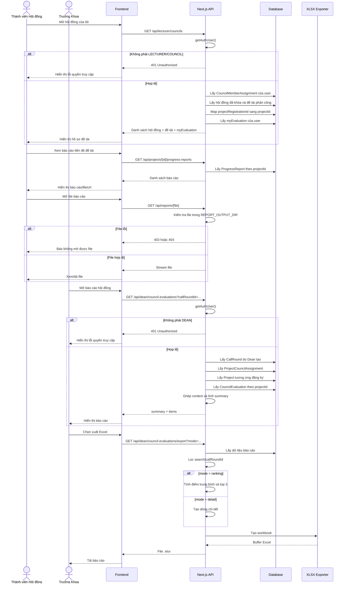

# Luồng sự kiện: Báo cáo kết quả hội đồng

## 1. Mục tiêu

Tài liệu mô tả luồng Trưởng Khoa xem, lọc và xuất báo cáo kết quả chấm điểm của hội đồng sau khi thành viên hội đồng đã đánh giá đề tài.

## 2. Tác nhân và phạm vi

| Thành phần | Nội dung |
|---|---|
| Tác nhân chính | Trưởng Khoa (`DEAN`) |
| Tác nhân phụ | Thành viên Hội đồng (`LECTURER` hoặc `COUNCIL`), sinh viên/nhóm đề tài |
| Dữ liệu nguồn | Kết quả `CouncilEvaluation` |
| API hội đồng xem đề tài | `GET /api/lecturer/councils` |
| API xem báo cáo tiến độ đề tài | `GET /api/projects/[id]/progress-reports` |
| API tải file báo cáo | `GET /api/reports/[file]` |
| API xem báo cáo | `GET /api/dean/council-evaluations` |
| API xuất Excel | `GET /api/dean/council-evaluations/export` |
| Client API | `api/dean-council-evaluations.ts` |
| Schema response | `types/dean-council-evaluation.schema.ts` |
| Bảng chính | `CallRound`, `Council`, `ProjectCouncilAssignment`, `ProjectRegistration`, `Project`, `CouncilEvaluation`, `User` |

## 3. Tiền điều kiện

1. Trưởng Khoa đã đăng nhập với role `DEAN`.
2. Đợt đề tài do Trưởng Khoa tạo tồn tại trong bảng `CallRound`.
3. Hội đồng thuộc đợt đã được tạo.
4. Đề tài đã được phân công cho hội đồng qua `ProjectCouncilAssignment`.
5. Đề tài đã có bản ghi chính thức trong bảng `Project`.
6. Thành viên hội đồng đã chấm điểm và tạo bản ghi `CouncilEvaluation` nếu Trưởng Khoa muốn xem kết quả đánh giá.

## 4. Luồng hội đồng xem báo cáo/hồ sơ đề tài

### Bước 1. Thành viên Hội đồng mở danh sách hội đồng được phân công

1. Thành viên Hội đồng đăng nhập với role `LECTURER` hoặc `COUNCIL`.
2. Giao diện gọi API:

```http
GET /api/lecturer/councils
```

3. Backend đọc session bằng `getAuthUser()`.
4. Nếu không có session hoặc role không thuộc `LECTURER`, `COUNCIL`, backend trả `401 Unauthorized`.
5. Backend chỉ lấy hội đồng mà người dùng là thành viên qua `CouncilMemberAssignment`.
6. Backend chỉ lấy hội đồng thuộc đợt đã khóa với `callRound.isLocked = true`.

### Bước 2. Backend trả dữ liệu hội đồng và đề tài

1. Backend include thông tin hội đồng:
   - `council.id`;
   - `council.name`;
   - `council.description`;
   - `callRoundId`;
   - `callRoundName`;
   - `defenseDate`;
   - `defenseLocation`;
   - số thành viên;
   - số đề tài;
   - danh sách thành viên hội đồng.
2. Backend include danh sách đề tài được phân công qua `ProjectCouncilAssignment`.
3. Với mỗi đề tài, backend trả:
   - `id`: `projectRegistration.id`;
   - `projectId`: mã đề tài chính thức nếu đã có trong bảng `Project`;
   - `title`: tên đề tài đăng ký;
   - `advisor`: giảng viên hướng dẫn;
   - `students`: trưởng nhóm và thành viên nhóm;
   - `myEvaluation`: kết quả chấm của chính thành viên đang đăng nhập nếu đã chấm.
4. Backend map `projectRegistrationId` sang `projectId` bằng quan hệ `Project.leader.registrations`.
5. Backend lấy `CouncilEvaluation` theo:
   - `projectId in projectIds`;
   - `councilMemberId = user.userId`.

Response rút gọn:

```json
{
  "success": true,
  "data": [
    {
      "assignmentId": "assignment-id",
      "role": "CHAIR",
      "joinedAt": "2026-06-01T08:00:00.000Z",
      "council": {
        "id": "council-id",
        "name": "Hội đồng 1",
        "callRoundId": "call-round-id",
        "callRoundName": "Đợt nghiệm thu 2026",
        "defenseDate": "2026-06-30T09:00:00.000Z",
        "defenseLocation": "Phòng A101",
        "memberCount": 5,
        "projectCount": 3,
        "projects": [
          {
            "id": "registration-id",
            "projectId": "project-id",
            "title": "Hệ thống quản lý đề tài nghiên cứu",
            "advisor": {
              "id": "lecturer-id",
              "name": "TS. Trần Văn B",
              "email": "lecturer@example.edu.vn",
              "code": "GV001"
            },
            "students": [
              {
                "id": "student-id",
                "name": "Nguyễn Văn A",
                "email": "student@example.edu.vn",
                "code": "SV001",
                "roleLabel": "Trưởng nhóm"
              }
            ],
            "myEvaluation": null
          }
        ]
      }
    }
  ]
}
```

### Bước 3. Thành viên Hội đồng chọn đề tài cần xem báo cáo

1. Thành viên Hội đồng mở chi tiết hội đồng.
2. Thành viên chọn một đề tài trong danh sách `council.projects`.
3. Giao diện hiển thị thông tin nền:
   - tên đề tài;
   - hội đồng phụ trách;
   - ngày/nơi bảo vệ;
   - giảng viên hướng dẫn;
   - trưởng nhóm;
   - thành viên nhóm;
   - trạng thái `myEvaluation` nếu đã chấm.
4. Nếu `projectId = null`, hệ thống chỉ có thể hiển thị dữ liệu đăng ký, chưa thể lấy báo cáo tiến độ theo API đề tài chính thức.

### Bước 4. Thành viên Hội đồng xem báo cáo tiến độ/hồ sơ đề tài

1. Khi đề tài có `projectId`, giao diện gọi API:

```http
GET /api/projects/[id]/progress-reports
```

2. Backend lấy danh sách `ProgressReport` theo `projectId`.
3. Backend sắp xếp theo `submittedAt desc`.
4. Backend trả danh sách báo cáo đã nộp:
   - kỳ/tuần báo cáo;
   - tóm tắt;
   - nội dung thực hiện;
   - kết quả;
   - `fileUrl` nếu có file;
   - ngày nộp.
5. Giao diện hiển thị các báo cáo để Hội đồng đọc trước khi chấm.

Response rút gọn:

```json
{
  "success": true,
  "data": [
    {
      "id": "report-id",
      "projectId": "project-id",
      "periodLabel": "Tuần 1",
      "summary": "Hoàn thành khảo sát yêu cầu",
      "fileUrl": "/api/reports/report-file.md",
      "submittedAt": "2026-06-20T08:00:00.000Z"
    }
  ]
}
```

### Bước 5. Thành viên Hội đồng mở file báo cáo

1. Nếu báo cáo có `fileUrl`, giao diện mở file trực tiếp hoặc tải xuống.
2. Với file sinh bởi bot/report service, hệ thống có route:

```http
GET /api/reports/[file]
```

3. Backend tìm file trong `REPORT_OUTPUT_DIR`.
4. Nếu file không nằm trong thư mục cho phép, backend trả `403 Forbidden`.
5. Nếu file không tồn tại, backend trả `404 Not found`.
6. Nếu file tồn tại, backend stream file về client.
7. Content type hiện hỗ trợ:
   - `.xlsx` -> `application/vnd.openxmlformats-officedocument.spreadsheetml.sheet`;
   - `.md` -> `text/markdown`;
   - loại khác -> `application/octet-stream`.

### Bước 6. Thành viên Hội đồng dùng báo cáo để chấm điểm

1. Thành viên đọc hồ sơ/báo cáo đề tài.
2. Thành viên đối chiếu mục tiêu, tiến độ, kết quả, minh chứng và phần trình bày bảo vệ.
3. Nếu chưa có `myEvaluation`, giao diện cho phép chấm điểm.
4. Nếu đã có `myEvaluation`, giao diện hiển thị điểm, quyết định, nhận xét và không cho chấm lại theo luồng hiện tại.
5. Kết quả chấm sau đó trở thành dữ liệu nguồn cho báo cáo Trưởng Khoa ở phần tiếp theo.

## 5. Luồng Trưởng Khoa xem báo cáo kết quả hội đồng trên hệ thống

### Bước 1. Trưởng Khoa mở màn báo cáo hội đồng

1. Trưởng Khoa truy cập màn hình báo cáo/kết quả chấm điểm hội đồng.
2. Giao diện gọi API lấy danh sách kết quả:

```http
GET /api/dean/council-evaluations
```

3. Nếu lọc theo đợt, giao diện truyền thêm `callRoundId`:

```http
GET /api/dean/council-evaluations?callRoundId=call-round-id
```

### Bước 2. Backend xác thực quyền

1. Backend đọc session bằng `getAuthUser()`.
2. Nếu không có session hoặc role khác `DEAN`, backend trả:

```json
{
  "success": false,
  "error": "Unauthorized"
}
```

3. Nếu hợp lệ, backend tiếp tục xử lý dữ liệu.

### Bước 3. Backend lấy phạm vi đợt của Trưởng Khoa

1. Backend lấy danh sách `CallRound` có `createdById = session.userId`.
2. Nếu có `callRoundId`, backend chỉ lấy đúng đợt đó.
3. Backend tạo danh sách `callRoundIds` để giới hạn dữ liệu báo cáo.
4. Trưởng Khoa chỉ thấy dữ liệu thuộc đợt do mình tạo.

### Bước 4. Backend gom ngữ cảnh hội đồng và đề tài

1. Backend lấy `ProjectCouncilAssignment` theo các hội đồng thuộc `callRoundIds`.
2. Backend include thông tin:
   - hội đồng;
   - đợt đề tài;
   - ngày bảo vệ;
   - địa điểm bảo vệ;
   - đăng ký đề tài;
   - sinh viên trưởng nhóm;
   - giảng viên hướng dẫn;
   - thành viên nhóm.
3. Backend tạo map ngữ cảnh theo `projectRegistrationId`.
4. Backend tìm `Project` tương ứng với các đăng ký đề tài.
5. Backend tạo map ngữ cảnh theo `projectId`.

### Bước 5. Backend lấy kết quả chấm điểm

1. Backend truy vấn `CouncilEvaluation` theo `projectId` thuộc map ngữ cảnh.
2. Backend include thông tin người chấm:
   - `id`;
   - `name`;
   - `code`;
   - `email`.
3. Backend sắp xếp kết quả theo thời điểm chấm mới nhất.

### Bước 6. Backend tạo dữ liệu báo cáo

1. Với mỗi bản ghi `CouncilEvaluation`, backend ghép thêm ngữ cảnh đề tài/hội đồng.
2. Mỗi dòng báo cáo gồm:
   - đợt đề tài;
   - hội đồng;
   - đề tài;
   - đăng ký đề tài;
   - ngày/nơi bảo vệ;
   - sinh viên trưởng nhóm;
   - giảng viên hướng dẫn;
   - thành viên hội đồng chấm;
   - điểm;
   - quyết định;
   - nhận xét;
   - thời điểm chấm.
3. Backend tính thống kê tổng hợp:
   - `totalEvaluations`: tổng số lượt chấm;
   - `totalProjects`: tổng số đề tài có điểm;
   - `averageScore`: điểm trung bình toàn bộ lượt chấm.

### Bước 7. Backend trả response cho giao diện

Response dạng tổng quát:

```json
{
  "success": true,
  "data": {
    "summary": {
      "totalEvaluations": 12,
      "totalProjects": 4,
      "averageScore": 8.25
    },
    "items": [
      {
        "id": "evaluation-id",
        "callRoundId": "call-round-id",
        "callRoundName": "Đợt nghiệm thu 2026",
        "councilId": "council-id",
        "councilName": "Hội đồng 1",
        "projectId": "project-id",
        "projectTitle": "Hệ thống quản lý đề tài nghiên cứu",
        "projectRegistrationId": "registration-id",
        "projectRegistrationTitle": "Hệ thống quản lý đề tài nghiên cứu",
        "defenseDate": "2026-06-30T09:00:00.000Z",
        "defenseLocation": "Phòng A101",
        "student": {
          "name": "Nguyễn Văn A",
          "code": "SV001",
          "email": "student@example.edu.vn",
          "className": "CNTT01"
        },
        "advisor": {
          "name": "TS. Trần Văn B",
          "code": "GV001",
          "email": "lecturer@example.edu.vn"
        },
        "evaluator": {
          "id": "lecturer-id",
          "name": "PGS. Lê Văn C",
          "code": "GV002",
          "email": "council@example.edu.vn"
        },
        "score": 8.5,
        "decision": "PASS",
        "comment": "Đề tài đạt yêu cầu.",
        "evaluatedAt": "2026-06-30T10:00:00.000Z"
      }
    ]
  }
}
```

### Bước 8. Giao diện hiển thị báo cáo

1. Giao diện parse dữ liệu bằng `deanCouncilEvaluationListSchema`.
2. Giao diện hiển thị thống kê tổng hợp.
3. Giao diện hiển thị danh sách kết quả chấm.
4. Trưởng Khoa có thể xem điểm từng thành viên hội đồng cho từng đề tài.
5. Trưởng Khoa đối chiếu quyết định `PASS`, `NEED_REVISION`, `FAIL` và nhận xét.

## 6. Luồng Trưởng Khoa xuất báo cáo Excel

### Bước 1. Trưởng Khoa chọn xuất file

1. Trưởng Khoa nhấn nút xuất báo cáo.
2. Giao diện gọi API:

```http
GET /api/dean/council-evaluations/export
```

3. Có thể truyền bộ lọc:

```http
GET /api/dean/council-evaluations/export?callRoundId=call-round-id&search=keyword
```

4. Nếu xuất bảng xếp hạng, truyền `mode=ranking`:

```http
GET /api/dean/council-evaluations/export?callRoundId=call-round-id&mode=ranking
```

### Bước 2. Backend xác thực và lấy dữ liệu

1. Backend kiểm tra session `DEAN`.
2. Backend lấy các đợt do Trưởng Khoa tạo.
3. Backend lấy phân công đề tài cho hội đồng.
4. Backend lấy thông tin đề tài, sinh viên, nhóm, giảng viên hướng dẫn.
5. Backend lấy các bản ghi `CouncilEvaluation`.

### Bước 3. Backend lọc dữ liệu xuất

1. Nếu có `search`, backend lọc theo chuỗi gồm:
   - tên đợt;
   - tên hội đồng;
   - tên đề tài;
   - tên đăng ký đề tài;
   - giảng viên hướng dẫn;
   - sinh viên trưởng nhóm;
   - người chấm;
   - nhận xét;
   - danh sách thành viên nhóm.
2. Nếu không có `search`, backend xuất toàn bộ dữ liệu trong phạm vi đợt.

### Bước 4. Backend tạo Excel chi tiết

1. Backend tạo workbook bằng `xlsx`.
2. Mỗi dòng thể hiện một kết quả chấm gắn với thành viên nhóm.
3. File có các nhóm thông tin:
   - thông tin đợt;
   - thông tin hội đồng;
   - thông tin đề tài;
   - trạng thái đăng ký;
   - giảng viên hướng dẫn;
   - sinh viên/thành viên nhóm;
   - người chấm;
   - điểm và kết luận.
4. Quyết định được chuyển nhãn:
   - `PASS` -> `Dat`;
   - `NEED_REVISION` -> `Can sua doi`;
   - `FAIL` -> `Khong dat`.

### Bước 5. Backend tạo Excel xếp hạng

1. Khi `mode=ranking`, backend nhóm dữ liệu theo hội đồng và đề tài.
2. Backend tính điểm trung bình từng đề tài.
3. Backend sắp xếp giảm dần theo điểm trung bình.
4. Backend gắn nhãn top 3:
   - `Nhất`;
   - `Nhì`;
   - `Ba`.
5. Backend xuất workbook xếp hạng theo từng hội đồng.

### Bước 6. Backend trả file

1. Backend trả buffer Excel với header:

```http
Content-Type: application/vnd.openxmlformats-officedocument.spreadsheetml.sheet
Cache-Control: no-store
```

2. Nếu không có dữ liệu, backend vẫn trả file Excel rỗng có thông báo `Không có dữ liệu theo bộ lọc hiện tại.`

## 7. Hậu điều kiện

1. Trưởng Khoa xem được báo cáo tổng hợp kết quả hội đồng.
2. Trưởng Khoa tải được file Excel phục vụ lưu trữ hoặc xét duyệt.
3. Không có dữ liệu chấm điểm mới được tạo trong luồng báo cáo.
4. Dữ liệu báo cáo chỉ đọc từ các bản ghi đã có.
5. Phạm vi dữ liệu bị giới hạn theo các đợt do Trưởng Khoa tạo.

## 8. Luồng rẽ nhánh

### A1. Không có quyền

1. Người dùng chưa đăng nhập hoặc không phải `DEAN`.
2. Backend trả `401 Unauthorized`.
3. Giao diện hiển thị lỗi không có quyền truy cập.

### A2. Không có đợt phù hợp

1. Trưởng Khoa chọn đợt không thuộc quyền quản lý hoặc chưa tạo đợt nào.
2. API xem báo cáo trả danh sách rỗng.
3. API xuất Excel trả file rỗng với thông báo không có dữ liệu.

### A3. Hội đồng chưa có đề tài

1. Có hội đồng nhưng chưa có `ProjectCouncilAssignment`.
2. Backend không tạo được ngữ cảnh `projectId`.
3. Báo cáo không có dòng kết quả cho hội đồng đó.

### A4. Đề tài chưa được chấm

1. Có đề tài được phân công nhưng chưa có `CouncilEvaluation`.
2. Báo cáo không có dòng điểm cho đề tài đó.
3. Đề tài chưa được tính vào `totalProjects` và `averageScore`.

### A5. Tìm kiếm không khớp dữ liệu

1. Trưởng Khoa nhập từ khóa `search`.
2. Backend lọc nhưng không có dòng phù hợp.
3. File Excel hoặc danh sách báo cáo hiển thị trạng thái không có dữ liệu.

### A6. Thành viên Hội đồng chưa thuộc hội đồng nào

1. Người dùng có role `LECTURER` hoặc `COUNCIL` nhưng chưa có `CouncilMemberAssignment`.
2. API `GET /api/lecturer/councils` trả danh sách rỗng.
3. Giao diện hiển thị chưa có hội đồng được phân công.

### A7. Đợt chưa khóa

1. Hội đồng tồn tại nhưng đợt chưa có `isLocked = true`.
2. API `GET /api/lecturer/councils` không trả hội đồng đó.
3. Thành viên Hội đồng chưa xem/chấm đề tài trong đợt đó.

### A8. Đề tài chưa có báo cáo tiến độ

1. Hội đồng mở đề tài có `projectId` hợp lệ.
2. API `GET /api/projects/[id]/progress-reports` trả danh sách rỗng.
3. Giao diện hiển thị chưa có báo cáo tiến độ/hồ sơ đã nộp.

### A9. File báo cáo không tồn tại

1. Thành viên Hội đồng mở `fileUrl`.
2. Backend không tìm thấy file trong `REPORT_OUTPUT_DIR`.
3. API `GET /api/reports/[file]` trả `404 Not found`.
4. Giao diện báo file không còn tồn tại hoặc chưa được tạo.

## 9. Quy tắc nghiệp vụ

1. Chỉ Trưởng Khoa (`DEAN`) được xem và xuất báo cáo hội đồng ở nhóm API `/api/dean/*`.
2. Trưởng Khoa chỉ xem dữ liệu các `CallRound` có `createdById = session.userId`.
3. Báo cáo được tạo từ dữ liệu chấm điểm thật trong `CouncilEvaluation`.
4. Điểm trung bình tổng hợp tính theo số lượt chấm, không tính theo số đề tài.
5. Báo cáo xếp hạng tính điểm trung bình theo từng đề tài trong từng hội đồng.
6. File Excel rỗng vẫn được trả thành công để người dùng biết bộ lọc không có dữ liệu.
7. Thành viên Hội đồng chỉ xem các hội đồng mà mình được phân công.
8. Thành viên Hội đồng chỉ thấy hội đồng thuộc đợt đã khóa (`isLocked = true`).
9. `myEvaluation` chỉ là kết quả chấm của chính thành viên đang đăng nhập, không phải toàn bộ điểm của hội đồng.
10. Báo cáo tiến độ được lấy theo `projectId`, nên đề tài chưa có bản ghi `Project` sẽ chưa lấy được báo cáo tiến độ qua API này.

## 10. Mermaid sequence diagram


