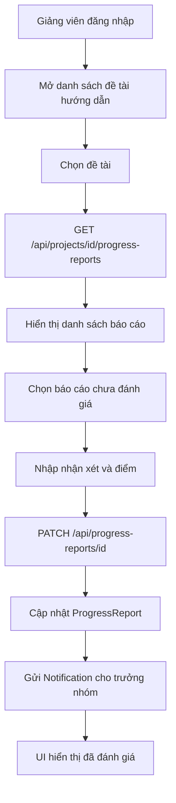

# Luồng sự kiện: Giảng viên xem và nhận xét báo cáo tiến độ

## 1. Mục tiêu

Tài liệu mô tả luồng giảng viên (`LECTURER`) xem danh sách đề tài đang hướng dẫn, xem báo cáo tiến độ sinh viên đã nộp và gửi nhận xét/điểm đánh giá cho từng báo cáo.

## 2. Tác nhân và phạm vi

| Thành phần | Nội dung |
|---|---|
| Tác nhân chính | Giảng viên hướng dẫn (`LECTURER`) |
| Tác nhân phụ | Sinh viên trưởng nhóm nhận thông báo |
| Màn hình | Trang đề tài/báo cáo tiến độ của giảng viên |
| API xem báo cáo | `GET /api/projects/[id]/progress-reports` |
| API nhận xét | `PATCH /api/progress-reports/[id]` |
| Schema nhận xét | `reviewProgressReportSchema` trong `types/progress-report.schema.ts` |
| Bảng chính | `Project`, `ProgressReport`, `Notification` |

## 3. Tiền điều kiện

1. Giảng viên đã đăng nhập.
2. Session hợp lệ, role = `LECTURER`.
3. Giảng viên có đề tài đang hướng dẫn, thường lọc theo `Project.instructorId = userId` ở frontend.
4. Sinh viên trưởng nhóm đã nộp ít nhất một báo cáo tiến độ cho đề tài.
5. Báo cáo tồn tại trong bảng `ProgressReport`.

## 4. Dữ liệu báo cáo tiến độ

| Trường | Ý nghĩa |
|---|---|
| `projectId` | Đề tài chứa báo cáo |
| `periodLabel` | Nhãn kỳ/tuần báo cáo |
| `week` | Tuần báo cáo nếu dùng mẫu tuần |
| `fromDate` | Ngày bắt đầu giai đoạn báo cáo |
| `toDate` | Ngày kết thúc giai đoạn báo cáo |
| `summary` | Tóm tắt tiến độ |
| `tasks` | Nhiệm vụ/kế hoạch |
| `performedContent` | Nội dung đã thực hiện |
| `results` | Kết quả đạt được |
| `reportContent` | Nội dung báo cáo chi tiết |
| `fileUrl` | File minh chứng đính kèm |
| `mentorReview` | Nhận xét của giảng viên |
| `mentorScore` | Điểm đánh giá của giảng viên |
| `submittedAt` | Thời điểm nộp báo cáo |

## 5. Luồng sự kiện chính

### Bước 1. Giảng viên mở danh sách đề tài

1. Giảng viên truy cập trang quản lý đề tài/báo cáo tiến độ.
2. Frontend tải danh sách đề tài liên quan.
3. Frontend lọc các đề tài có `instructorId = userId`.
4. Hệ thống hiển thị bảng đề tài gồm tên đề tài, trưởng nhóm, đợt đăng ký, trạng thái và thao tác xem báo cáo.

### Bước 2. Giảng viên chọn đề tài cần xem tiến độ

1. Giảng viên nhấn xem báo cáo của một đề tài.
2. Frontend lưu `selectedProjectId`.
3. Frontend gọi API:

```http
GET /api/projects/[id]/progress-reports
```

4. Backend lấy danh sách `ProgressReport` theo `projectId`.
5. Backend sắp xếp theo `submittedAt desc`.
6. Backend trả danh sách báo cáo.

Response thành công dạng tổng quát:

```json
{
  "success": true,
  "data": [
    {
      "id": "progress-report-id",
      "projectId": "project-id",
      "periodLabel": "Tuần 1",
      "week": 1,
      "summary": "Đã hoàn thành khảo sát tài liệu",
      "fileUrl": "/uploads/report.pdf",
      "mentorReview": null,
      "mentorScore": null,
      "submittedAt": "2026-06-20T10:00:00.000Z"
    }
  ]
}
```

### Bước 3. Hệ thống hiển thị chi tiết báo cáo

1. Frontend hiển thị danh sách báo cáo theo kỳ/tuần.
2. Mỗi báo cáo hiển thị:
   - nhãn kỳ báo cáo;
   - nội dung sinh viên nộp;
   - file đính kèm nếu có;
   - trạng thái đã/chưa đánh giá;
   - nhận xét và điểm nếu đã có.
3. Nếu `fileUrl` có dữ liệu, giảng viên có thể xem file hoặc mở tab mới.

### Bước 4. Giảng viên nhập nhận xét

1. Giảng viên chọn báo cáo chưa đánh giá.
2. Hệ thống mở dialog/form nhận xét.
3. Giảng viên nhập `mentorReview`.
4. Giảng viên nhập `mentorScore` trong khoảng `0` đến `10`.
5. Frontend validate dữ liệu bắt buộc.

Payload gửi lên:

```json
{
  "mentorReview": "Báo cáo rõ ràng, cần bổ sung phần kết quả thực nghiệm.",
  "mentorScore": 8.5
}
```

### Bước 5. Backend xử lý nhận xét

1. Frontend gọi:

```http
PATCH /api/progress-reports/[id]
```

2. Backend đọc actor từ request bằng `getActorRole` và `getActorUserId`.
3. Nếu thiếu actor, backend trả `401 Unauthorized`.
4. Backend validate body bằng `reviewProgressReportSchema`:
   - `mentorReview`: bắt buộc, không rỗng.
   - `mentorScore`: số từ `0` đến `10`.
5. Backend tìm `ProgressReport` theo `id`, include `project`.
6. Nếu không tìm thấy báo cáo, backend trả `404 Report not found`.
7. Backend kiểm tra quyền nhận xét. Role được phép: `ADMIN`, `DEAN`, `COUNCIL`, `LEADER`, `LECTURER`.
8. Backend cập nhật:
   - `ProgressReport.mentorReview`.
   - `ProgressReport.mentorScore`.
9. Backend gọi `notifyProgressReportReviewed` để gửi thông báo cho trưởng nhóm đề tài.
10. Nếu gửi thông báo lỗi, backend log lỗi nhưng không làm fail request.
11. Backend trả response thành công.

Response thành công dạng tổng quát:

```json
{
  "success": true,
  "data": {
    "id": "progress-report-id",
    "mentorReview": "Báo cáo rõ ràng, cần bổ sung phần kết quả thực nghiệm.",
    "mentorScore": 8.5
  }
}
```

### Bước 6. Frontend cập nhật giao diện

1. Frontend nhận response thành công.
2. Hiển thị toast lưu nhận xét thành công.
3. Đóng dialog nhận xét.
4. Invalidate/refetch query danh sách báo cáo.
5. Báo cáo hiển thị badge đã đánh giá.
6. Điểm và nhận xét mới được hiển thị cho giảng viên.
7. Sinh viên trưởng nhóm nhận thông báo báo cáo đã được nhận xét.

## 6. Hậu điều kiện

1. Báo cáo vẫn thuộc đề tài ban đầu.
2. `ProgressReport.mentorReview` được cập nhật.
3. `ProgressReport.mentorScore` được cập nhật.
4. Notification được tạo/gửi cho `project.leaderId` nếu dịch vụ thông báo hoạt động.
5. UI giảng viên hiển thị báo cáo đã đánh giá.

## 7. Luồng rẽ nhánh

### A1. Báo cáo chưa có file đính kèm

1. `fileUrl = null`.
2. Frontend không hiển thị iframe/link file.
3. Giảng viên vẫn xem nội dung text và nhận xét bình thường.

### A2. Báo cáo đã có nhận xét

1. Frontend hiển thị `mentorReview` và `mentorScore`.
2. UI có thể khóa nút nhận xét lại theo quy tắc hiện tại.
3. Nếu frontend vẫn gọi API, backend hiện tại vẫn cho phép cập nhật nếu role hợp lệ.

### A3. Gửi thông báo thất bại

1. Backend cập nhật nhận xét thành công.
2. Hàm `notifyProgressReportReviewed` lỗi.
3. Backend ghi log `Failed to send notification:`.
4. Request vẫn trả success.

### A4. Không có báo cáo trong đề tài

1. API trả `data = []`.
2. Frontend hiển thị trạng thái trống.
3. Giảng viên chờ sinh viên nộp báo cáo.

## 8. Luồng ngoại lệ

### E1. Chưa đăng nhập hoặc hết phiên

1. Request nhận xét không có actor hợp lệ.
2. Backend trả:

```json
{
  "success": false,
  "error": "Unauthorized"
}
```

3. Frontend chuyển về đăng nhập hoặc báo phiên hết hạn.

### E2. Không có quyền nhận xét

1. Role không thuộc danh sách được phép.
2. Backend trả `403` với lỗi:

```json
{
  "success": false,
  "error": "Không có quyền nhận xét."
}
```

### E3. Payload nhận xét không hợp lệ

1. `mentorReview` rỗng hoặc thiếu.
2. `mentorScore < 0` hoặc `mentorScore > 10`.
3. Schema trả lỗi validate.
4. Backend trả `400 Invalid payload`.
5. Frontend hiển thị lỗi trên form.

### E4. Không tìm thấy báo cáo

1. `id` báo cáo không tồn tại.
2. Backend trả `404 Report not found`.
3. Frontend hiển thị lỗi và refetch danh sách.

### E5. Lỗi database/API

1. Backend lỗi khi cập nhật `ProgressReport`.
2. Backend trả:

```json
{
  "success": false,
  "error": "Failed to update review"
}
```

3. Frontend giữ dialog để giảng viên thử lại.

## 9. Bảng dữ liệu liên quan

| Bảng | Vai trò trong luồng |
|---|---|
| `Project` | Đề tài giảng viên hướng dẫn, chứa `leaderId` để gửi thông báo |
| `ProgressReport` | Lưu nội dung báo cáo, file, nhận xét và điểm |
| `Notification` | Thông báo cho trưởng nhóm sau khi báo cáo được nhận xét |
| `CallRound` | Có thể cung cấp mẫu tuần và mốc thời gian báo cáo |
| `ProgressReportTemplate` | Mẫu báo cáo tiến độ gắn với đợt đăng ký |

## 10. Quy tắc nghiệp vụ

1. Giảng viên chỉ nên xem các đề tài có `instructorId = userId`.
2. Backend nhận xét hiện cho phép các role: `ADMIN`, `DEAN`, `COUNCIL`, `LEADER`, `LECTURER`.
3. `mentorReview` bắt buộc không rỗng.
4. `mentorScore` từ `0` đến `10`.
5. Sinh viên chỉ nộp một báo cáo cho mỗi `week` hoặc `periodLabel` trong cùng đề tài.
6. Mẫu tiến độ lấy từ `CallRound.template`; giảng viên chỉ xem báo cáo đã nộp, không chỉnh mẫu.
7. Nếu thông báo lỗi, kết quả nhận xét không bị rollback.

## 11. Sơ đồ luồng



## 12. Tài liệu/code tham chiếu

- Use case: `uml/uc/lecturer/use-case-xem-nhan-xet-tien-do-luong-su-kien.md`
- API xem/nộp báo cáo: `app/api/projects/[id]/progress-reports/route.ts`
- API nhận xét báo cáo: `app/api/progress-reports/[id]/route.ts`
- Schema: `types/progress-report.schema.ts`
- Prisma schema: `prisma/schema.prisma`
