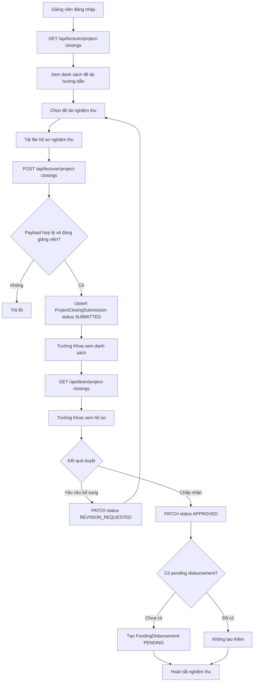
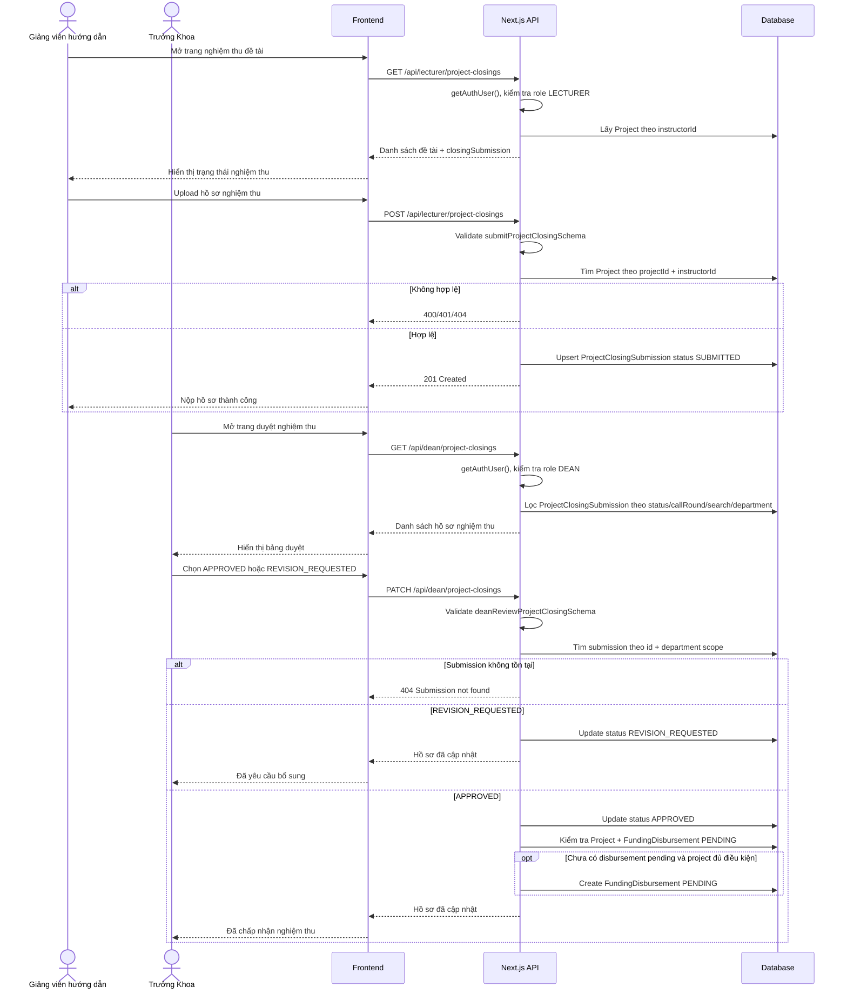

# Luồng sự kiện: Nghiệm thu đề tài

## 1. Mục tiêu

Tài liệu mô tả luồng Giảng viên hướng dẫn nộp hồ sơ nghiệm thu/kết thúc đề tài và Trưởng Khoa duyệt hồ sơ nghiệm thu.

## 2. Tác nhân và phạm vi

| Thành phần | Nội dung |
|---|---|
| Tác nhân nộp hồ sơ | Giảng viên hướng dẫn (`LECTURER`) |
| Tác nhân duyệt | Trưởng Khoa (`DEAN`) |
| Màn hình giảng viên | Quản lý nghiệm thu/kết thúc đề tài |
| Màn hình Trưởng Khoa | Duyệt nghiệm thu đề tài |
| API giảng viên xem danh sách | `GET /api/lecturer/project-closings` |
| API giảng viên nộp hồ sơ | `POST /api/lecturer/project-closings` |
| API Trưởng Khoa xem danh sách | `GET /api/dean/project-closings` |
| API Trưởng Khoa duyệt | `PATCH /api/dean/project-closings` |
| API xuất Excel | `GET /api/dean/project-closings/export` |
| Schema validate | `types/project-closing.schema.ts` |
| Bảng chính | `Project`, `ProjectClosingSubmission`, `FundingDisbursement`, `User`, `CallRound` |

## 3. Tiền điều kiện

1. Giảng viên hướng dẫn đã đăng nhập với role `LECTURER`.
2. Đề tài tồn tại trong bảng `Project`.
3. Đề tài có `instructorId = user.userId` của giảng viên đang nộp.
4. Hồ sơ nghiệm thu gồm đủ nhóm file bắt buộc theo `submitProjectClosingSchema`.
5. Trưởng Khoa đã đăng nhập với role `DEAN`.
6. Nếu Trưởng Khoa có `departmentId`, chỉ xem/duyệt hồ sơ của sinh viên thuộc khoa đó.

## 4. Trạng thái nghiệm thu

| Trạng thái | Ý nghĩa |
|---|---|
| `SUBMITTED` | Giảng viên đã nộp hồ sơ nghiệm thu |
| `REVISION_REQUESTED` | Trưởng Khoa yêu cầu bổ sung/chỉnh sửa hồ sơ |
| `APPROVED` | Trưởng Khoa chấp nhận hồ sơ nghiệm thu |

## 5. Dữ liệu nộp hồ sơ nghiệm thu

Mỗi file có dạng:

```json
{
  "name": "bao-cao-nghiem-thu.pdf",
  "url": "https://.../bao-cao-nghiem-thu.pdf"
}
```

Payload `POST /api/lecturer/project-closings`:

```json
{
  "projectId": "project-id",
  "note": "Hồ sơ nghiệm thu đề tài đã hoàn tất.",
  "reportFiles": [{ "name": "bao-cao.pdf", "url": "https://.../bao-cao.pdf" }],
  "researchSourceCodeFiles": [{ "name": "source.zip", "url": "https://.../source.zip" }],
  "researchGuideFiles": [{ "name": "huong-dan.pdf", "url": "https://.../huong-dan.pdf" }],
  "administrativeDefenseApplicationFiles": [{ "name": "don-xin-nghiem-thu.pdf", "url": "https://.../don-xin-nghiem-thu.pdf" }],
  "administrativeAchievementEvidenceFiles": [{ "name": "minh-chung-thanh-tich.pdf", "url": "https://.../minh-chung-thanh-tich.pdf" }],
  "administrativeAdvisorReviewFiles": [{ "name": "nhan-xet-gvhd.pdf", "url": "https://.../nhan-xet-gvhd.pdf" }],
  "presentationSlideFiles": [{ "name": "slide.pdf", "url": "https://.../slide.pdf" }],
  "presentationVideoFiles": [{ "name": "video.mp4", "url": "https://.../video.mp4" }]
}
```

Nhóm file bắt buộc:

1. `reportFiles`: báo cáo đề tài.
2. `researchSourceCodeFiles`: source code.
3. `researchGuideFiles`: tài liệu hướng dẫn.
4. `administrativeDefenseApplicationFiles`: đơn xin bảo vệ/nghiệm thu đề tài NCKH.
5. `administrativeAchievementEvidenceFiles`: minh chứng thành tích.
6. `administrativeAdvisorReviewFiles`: bản nhận xét của giảng viên hướng dẫn.
7. `presentationSlideFiles`: slide thuyết trình.

Nhóm file không bắt buộc:

1. `presentationVideoFiles`: video thuyết trình, mặc định `[]`.

## 6. Luồng sự kiện chính

Tóm tắt luồng:

1. Giảng viên mở danh sách đề tài được hướng dẫn.
2. Giảng viên chọn đề tài cần nghiệm thu.
3. Giảng viên tải lên đầy đủ hồ sơ nghiệm thu.
4. Backend validate quyền và payload.
5. Backend tạo hoặc cập nhật `ProjectClosingSubmission` với trạng thái `SUBMITTED`.
6. Trưởng Khoa xem danh sách hồ sơ đã nộp.
7. Trưởng Khoa duyệt `APPROVED` hoặc yêu cầu bổ sung `REVISION_REQUESTED`.
8. Nếu `APPROVED`, backend tự tạo bản ghi giải ngân `FundingDisbursement` trạng thái `PENDING` nếu chưa có giải ngân pending.

### Bước 1. Giảng viên mở danh sách nghiệm thu

1. Giảng viên đăng nhập.
2. Frontend gọi:

```http
GET /api/lecturer/project-closings
```

3. Backend kiểm tra `getAuthUser()` và role `LECTURER`.
4. Backend lấy các đề tài có `instructorId = user.userId`.
5. Backend include `callRound`, sinh viên trưởng nhóm và `closingSubmission` nếu đã nộp.
6. Frontend hiển thị danh sách đề tài và trạng thái nghiệm thu hiện tại.

Response dạng tổng quát:

```json
{
  "success": true,
  "data": [
    {
      "project": {
        "id": "project-id",
        "title": "Tên đề tài",
        "status": "IN_PROGRESS",
        "callRound": { "id": "call-round-id", "name": "Đợt 2026" },
        "student": {
          "id": "student-id",
          "name": "Nguyễn Văn A",
          "code": "SV001",
          "email": "student@example.edu.vn"
        }
      },
      "submission": null
    }
  ]
}
```

### Bước 2. Giảng viên nộp hồ sơ nghiệm thu

1. Giảng viên chọn đề tài.
2. Giảng viên tải file lên hệ thống lưu trữ và nhận `{ name, url }`.
3. Frontend gom file theo đúng nhóm trong `submitProjectClosingSchema`.
4. Frontend gọi:

```http
POST /api/lecturer/project-closings
Content-Type: application/json
```

5. Backend kiểm tra role `LECTURER`.
6. Backend parse body bằng `submitProjectClosingSchema`.
7. Backend kiểm tra đề tài có tồn tại và thuộc giảng viên bằng `id = projectId`, `instructorId = user.userId`.
8. Backend dùng `upsert` theo `projectId`:
   - Nếu chưa có hồ sơ: tạo mới `ProjectClosingSubmission`.
   - Nếu đã có hồ sơ: cập nhật hồ sơ cũ.
9. Backend set:
   - `submittedById = user.userId`.
   - `status = SUBMITTED`.
   - `note = parsed.data.note ?? null`.
   - các nhóm file theo payload.
   - `submittedAt = new Date()`.
10. Backend trả `201 Created`.

Response thành công dạng tổng quát:

```json
{
  "success": true,
  "data": {
    "id": "submission-id",
    "projectId": "project-id",
    "submittedById": "lecturer-id",
    "status": "SUBMITTED",
    "note": "Hồ sơ nghiệm thu đề tài đã hoàn tất.",
    "reportFiles": [{ "name": "bao-cao.pdf", "url": "https://.../bao-cao.pdf" }],
    "researchSourceCodeFiles": [{ "name": "source.zip", "url": "https://.../source.zip" }],
    "researchGuideFiles": [{ "name": "huong-dan.pdf", "url": "https://.../huong-dan.pdf" }],
    "administrativeDefenseApplicationFiles": [{ "name": "don-xin-nghiem-thu.pdf", "url": "https://.../don-xin-nghiem-thu.pdf" }],
    "administrativeAchievementEvidenceFiles": [{ "name": "minh-chung-thanh-tich.pdf", "url": "https://.../minh-chung-thanh-tich.pdf" }],
    "administrativeAdvisorReviewFiles": [{ "name": "nhan-xet-gvhd.pdf", "url": "https://.../nhan-xet-gvhd.pdf" }],
    "presentationSlideFiles": [{ "name": "slide.pdf", "url": "https://.../slide.pdf" }],
    "presentationVideoFiles": [],
    "submittedAt": "2026-06-30T09:00:00.000Z",
    "createdAt": "2026-06-30T09:00:00.000Z",
    "updatedAt": "2026-06-30T09:00:00.000Z"
  }
}
```

### Bước 3. Trưởng Khoa xem danh sách hồ sơ nghiệm thu

1. Trưởng Khoa đăng nhập.
2. Frontend gọi:

```http
GET /api/dean/project-closings?status=SUBMITTED&callRoundId=call-round-id&search=keyword
```

3. Backend kiểm tra role `DEAN`.
4. Backend validate `status` nếu có; chỉ nhận `SUBMITTED`, `REVISION_REQUESTED`, `APPROVED`.
5. Backend lọc hồ sơ theo:
   - `status` nếu có.
   - `callRoundId` nếu có.
   - `search` theo tên đề tài, tên sinh viên, mã sinh viên, tên giảng viên, tên đợt.
   - `session.departmentId` nếu có, qua `project.leader.departmentId`.
6. Backend trả danh sách hồ sơ, thông tin đề tài, sinh viên, giảng viên hướng dẫn.
7. Frontend hiển thị bảng duyệt nghiệm thu.

### Bước 4. Trưởng Khoa duyệt hoặc yêu cầu bổ sung

1. Trưởng Khoa mở chi tiết hồ sơ.
2. Trưởng Khoa xem các nhóm file nghiệm thu.
3. Trưởng Khoa chọn kết quả:
   - `APPROVED`: chấp nhận nghiệm thu.
   - `REVISION_REQUESTED`: yêu cầu bổ sung/chỉnh sửa.
4. Frontend gửi:

```http
PATCH /api/dean/project-closings
Content-Type: application/json
```

```json
{
  "submissionId": "submission-id",
  "status": "APPROVED",
  "note": "Hồ sơ đạt yêu cầu nghiệm thu."
}
```

5. Backend kiểm tra role `DEAN`.
6. Backend validate payload bằng `deanReviewProjectClosingSchema`.
7. Backend tìm `ProjectClosingSubmission` theo `submissionId`, đồng thời áp dụng `departmentId` nếu có.
8. Nếu không tìm thấy, trả `404 Submission not found`.
9. Backend cập nhật:
   - `status = parsed.data.status`.
   - `note = normalizedNote ?? existing.note`.
10. Nếu status là `APPROVED`, backend kiểm tra đề tài.
11. Nếu `project.status` thuộc `APPROVED`, `IN_PROGRESS`, `COMPLETED`, backend kiểm tra đã có `FundingDisbursement` trạng thái `PENDING` chưa.
12. Nếu chưa có, backend tạo `FundingDisbursement`:
    - `projectId = project.id`.
    - `amount = project.budgetApproved` nếu > 0, ngược lại `1`.
    - `disbursedAt = new Date()`.
    - `reason = Tự động tạo khi Trưởng khoa chấp nhận hồ sơ nghiệm thu đề tài`.
    - `status = PENDING`.
    - `createdById = session.userId`.
13. Backend trả hồ sơ đã cập nhật.

### Bước 5. Trưởng Khoa xuất Excel nghiệm thu

1. Trưởng Khoa chọn bộ lọc nếu cần.
2. Frontend gọi:

```http
GET /api/dean/project-closings/export?status=APPROVED&callRoundId=call-round-id&search=keyword
```

3. Backend kiểm tra role `DEAN`.
4. Backend lọc dữ liệu tương tự API danh sách.
5. Backend tạo file Excel sheet `Nghiem thu de tai`.
6. File trả về có tên dạng `dean-project-closings-YYYYMMDD-HHmm.xlsx`.

## 7. Luồng rẽ nhánh

### A1. Hồ sơ đã tồn tại và giảng viên nộp lại

1. Backend `upsert` theo `projectId`.
2. Hồ sơ cũ được cập nhật file, ghi chú, người nộp và `submittedAt` mới.
3. Trạng thái quay về `SUBMITTED`.

### A2. Trưởng Khoa yêu cầu bổ sung

1. Trưởng Khoa gửi `status = REVISION_REQUESTED`.
2. Backend cập nhật trạng thái hồ sơ.
3. Giảng viên thấy hồ sơ cần chỉnh sửa.
4. Giảng viên nộp lại hồ sơ qua `POST /api/lecturer/project-closings`.
5. Backend cập nhật hồ sơ và chuyển lại `SUBMITTED`.

### A3. Trưởng Khoa chấp nhận hồ sơ

1. Trưởng Khoa gửi `status = APPROVED`.
2. Backend cập nhật hồ sơ nghiệm thu.
3. Backend tự tạo giải ngân `PENDING` nếu đủ điều kiện và chưa có giải ngân pending.
4. Bộ phận liên quan xử lý giải ngân ở luồng giải ngân.

### A4. Đề tài không thuộc khoa của Trưởng Khoa

1. Session có `departmentId`.
2. Backend chỉ tìm hồ sơ có `project.leader.departmentId = session.departmentId`.
3. Nếu hồ sơ thuộc khoa khác, API PATCH trả `404 Submission not found`.

## 8. Luồng ngoại lệ

### E1. Chưa đăng nhập hoặc sai role khi giảng viên nộp

1. `getAuthUser()` không có user hoặc role khác `LECTURER`.
2. Backend trả:

```json
{
  "success": false,
  "error": "Unauthorized"
}
```

### E2. Payload nộp hồ sơ không hợp lệ

1. Thiếu `projectId` hoặc `projectId` không phải `cuid`.
2. Thiếu một trong các nhóm file bắt buộc.
3. File thiếu `name` hoặc `url`.
4. Backend trả `400 Invalid payload` kèm `fields`.

### E3. Đề tài không tồn tại hoặc không thuộc giảng viên

1. Backend không tìm thấy `Project` theo `projectId` và `instructorId = user.userId`.
2. Backend trả:

```json
{
  "success": false,
  "error": "Project not found"
}
```

### E4. Trưởng Khoa xem danh sách với status không hợp lệ

1. Query `status` không thuộc `SUBMITTED`, `REVISION_REQUESTED`, `APPROVED`.
2. Backend trả `400 Invalid status filter`.

### E5. Trưởng Khoa duyệt payload không hợp lệ

1. Thiếu `submissionId` hoặc `status`.
2. `status` không thuộc `REVISION_REQUESTED`, `APPROVED`.
3. Backend trả `400 Invalid payload` kèm `fields`.

### E6. Hồ sơ không tồn tại

1. Backend không tìm thấy `ProjectClosingSubmission` theo `submissionId` và phạm vi khoa.
2. Backend trả:

```json
{
  "success": false,
  "error": "Submission not found"
}
```

### E7. Lỗi database/API

1. Backend lỗi khi query, upsert hoặc update.
2. API giảng viên trả `Failed to submit project closing` hoặc `Failed to fetch project closings`.
3. API Trưởng Khoa trả `Failed to review project closing` hoặc `Failed to fetch project closings`.

## 9. Bảng dữ liệu liên quan

| Bảng | Vai trò trong luồng |
|---|---|
| `Project` | Đề tài được nghiệm thu |
| `ProjectClosingSubmission` | Hồ sơ nghiệm thu/kết thúc đề tài |
| `User` | Giảng viên, sinh viên trưởng nhóm, Trưởng Khoa |
| `CallRound` | Đợt đề tài/nghiệm thu |
| `FundingDisbursement` | Bản ghi giải ngân tự tạo sau khi nghiệm thu được duyệt |

## 10. Quy tắc nghiệp vụ

1. Chỉ `LECTURER` có thể nộp hồ sơ nghiệm thu qua route giảng viên.
2. Giảng viên chỉ nộp hồ sơ cho đề tài mình hướng dẫn (`instructorId = user.userId`).
3. Mỗi đề tài có một hồ sơ nghiệm thu theo `projectId`; nộp lại sẽ cập nhật hồ sơ cũ.
4. Mỗi lần nộp hoặc nộp lại đặt trạng thái hồ sơ là `SUBMITTED`.
5. `DEAN` chỉ duyệt hồ sơ trong phạm vi khoa nếu session có `departmentId`.
6. Trưởng Khoa chỉ có thể chọn `REVISION_REQUESTED` hoặc `APPROVED` khi review.
7. `note` của Trưởng Khoa được trim; nếu trống thì giữ `existing.note`.
8. Khi hồ sơ được `APPROVED`, hệ thống có thể tự tạo giải ngân pending cho đề tài.
9. Việc duyệt nghiệm thu hiện không tự đổi `Project.status` trong API này; route chỉ cập nhật `ProjectClosingSubmission.status` và có thể tạo `FundingDisbursement`.
10. File trong hồ sơ lưu dưới dạng JSON array `{ name, url }` theo từng nhóm.

## 11. Sơ đồ luồng



## 12. Sequence diagram chi tiết



## 13. Tài liệu/code tham chiếu

- API giảng viên nghiệm thu: `app/api/lecturer/project-closings/route.ts`
- API Trưởng Khoa nghiệm thu: `app/api/dean/project-closings/route.ts`
- API export Excel: `app/api/dean/project-closings/export/route.ts`
- API client giảng viên: `api/lecturer-project-closings.ts`
- API client Trưởng Khoa: `api/dean-project-closings.ts`
- Schema: `types/project-closing.schema.ts`
- Bảng dữ liệu: `docs/database-main-tables.md`
